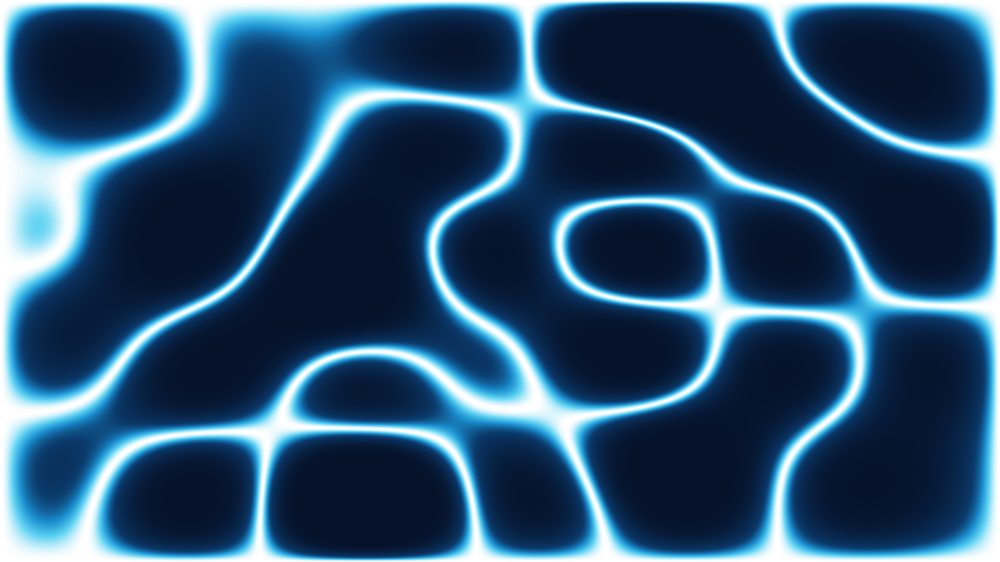
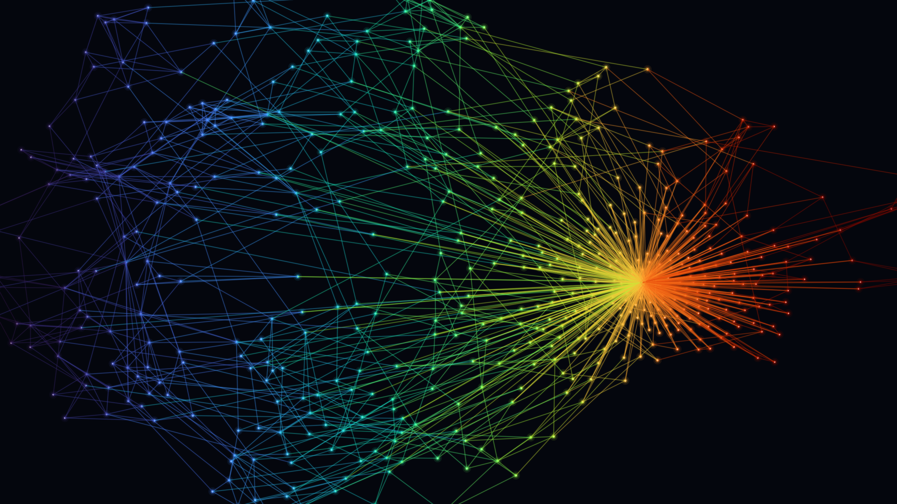

# The Butterfly Effect — generative backgrounds from AI-model internals

Abstract, luminous background images generated from the **real internals of a language
model** (GPT-2) — its weights, activations, attention, loss surface and embedding
geometry — plus one nod to the chaos theory the project is named after.

Every piece is dark, minimal and resolution-independent, so it works as a **desktop or
phone wallpaper, slide/Zoom background, website hero, social image, print, or profile
header**. Nothing is a stock gradient: the structure comes from what the model learned.


|  |  |
|---|---|
|  |  |
|  |  |

## Concepts

Each lives in its own folder under [`concepts/`](concepts) with a `generate.py`, a
`gallery/` of samples, and a README explaining the technique and what it represents.

| # | Concept | From | What it visualizes |
|---|---------|------|--------------------|
| 1 | [hidden-state-divergence](concepts/1-hidden-state-divergence) | activations | two high-temp runs' hidden states diverging after the shared prompt |
| 2 | [attention-arcs](concepts/2-attention-arcs) | attention | strongest links where two runs attend differently |
| 3 | [loss-landscape](concepts/3-loss-landscape) | weights + loss | GPT-2's real filter-normalized loss surface + descent path |
| 4 | [spectral-interference](concepts/4-spectral-interference) | weights (SVD) | wave interference driven by a weight matrix's singular spectrum |
| 5 | [chladni-eigenmodes](concepts/5-chladni-eigenmodes) | weights (SVD) | vibrating-plate nodal patterns from the singular spectrum |
| 6 | [strange-attractor](concepts/6-strange-attractor) | chaos theory | Lorenz & friends — the literal butterfly effect (procedural) |
| 7 | [embedding-constellation](concepts/7-embedding-constellation) | embeddings | k-NN graph of token embeddings — the "shape of language" |
| 8 | [forking-paths-tree](concepts/8-forking-paths-tree) | decoding | the branching tree of possible next-token continuations |
| 9 | [attention-head-atlas](concepts/9-attention-head-atlas) | attention | all 144 attention heads as a 12×12 map of the model's routing |
| 10 | [logit-lens-aurora](concepts/10-logit-lens-aurora) | logit lens | how the prediction sharpens layer by layer |

Every concept derives from real GPT-2 data except the strange attractor (pure
procedural chaos). Small precomputed caches are shipped, so all concepts render
immediately without a GPU or download; delete a cache (or ask for a new `--seed`) to
recompute from GPT-2 on demand via `transformers`.

## Install

Python 3.10+.

```bash
python -m venv .venv && source .venv/bin/activate
pip install -r requirements.txt
```

All concepts render offline immediately from the shipped caches (no model, no GPU).
Only requesting *new* generation parameters in a model-backed concept (a different
`--seed`, or the forking tree's `--prompt`/`--temp`/…) downloads GPT-2 (~500 MB, once)
via `transformers` to recompute.

## Generate

Every concept has the same CLI. Run from inside its folder:

```bash
cd concepts/4-spectral-interference
python generate.py --size wallpaper_4k --palette steel --studio
python generate.py --size 2560x1440 --palette pastel_sky --seed 5
```

Common flags: `--size` (preset or `WIDTHxHEIGHT`), `--out`, and per-concept
`--palette` / `--seed` / `--style` / `--layer` / `--attractor` (see each folder's
README, or `python generate.py --help`).

## Sizes

Because the art is continuous fields or vector line-work, it renders crisp at any size
and aspect (field-based concepts widen their sampling domain to match). Presets live in
[`common/presets.py`](common/presets.py):

| Preset | Pixels | Preset | Pixels |
|--------|--------|--------|--------|
| `wallpaper_4k` | 3840×2160 | `banner` | 1584×396 |
| `wallpaper_2k` | 2560×1440 | `wide` | 1920×480 |
| `ultrawide` | 3440×1440 | `phone` | 1290×2796 |
| `square` | 2048×2048 | `print_a4` | 3508×2480 |

…or pass any `--size 3000x1200`.

## Repository layout

```
common/presets.py     shared sizes + figure helpers
concepts/<n>-<name>/
    generate.py       one CLI per concept
    gallery/          sample renders
    README.md         technique + what it represents
    *.npy / *.npz     small precomputed model-data caches
```

## Tests

A pytest smoke suite runs every generator at a tiny size and checks it exits cleanly
and emits a correctly-sized PNG, plus unit tests for the size parser.

```bash
pip install -r requirements-dev.txt
pytest     # runs offline from the shipped caches
```

The fast suite needs no model download, so it doubles as a check that the shipped
`.npy`/`.npz` caches are valid. Lint + the fast suite also run in CI on every push
([`.github/workflows/ci.yml`](.github/workflows/ci.yml)).

## License

[MIT](LICENSE) — reuse the code and the generated images freely, including commercially.
Attribution appreciated but not required.
