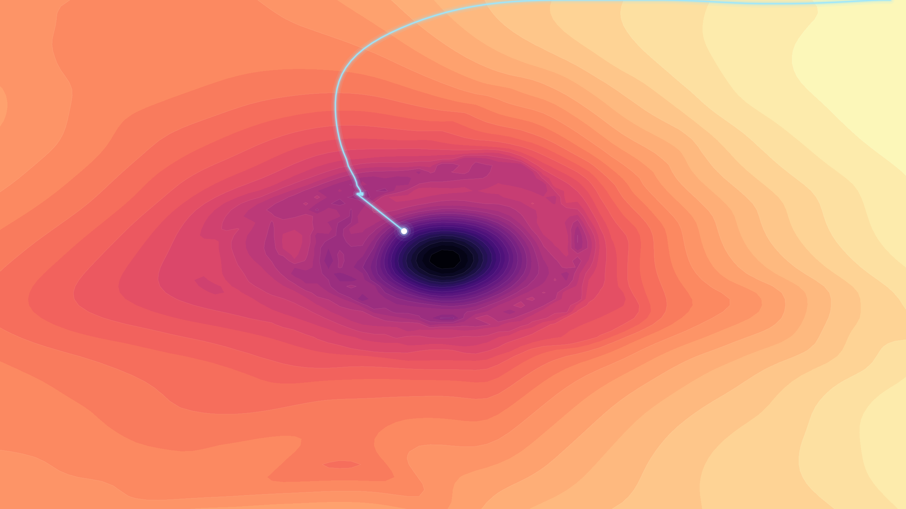

# The Butterfly Effect — generative backgrounds from AI-model internals

Abstract, luminous background images generated from the **real internals of a language
model** (GPT-2) — its weights, activations, attention, loss surface and embedding
geometry — plus one nod to the chaos theory the project is named after.

Every piece is dark, minimal and resolution-independent, so it works as a **desktop or
phone wallpaper, slide/Zoom background, website hero, social image, print, or profile
header**. Nothing is a stock gradient: the structure comes from what the model learned.


|  |  |
|---|---|
|  |  |
|  |  |

## Concepts

Each lives in its own folder under [`concepts/`](concepts) with a `generate.py`, a
`gallery/` of samples, and a README explaining the technique and what it represents.

| # | Concept | From | What it visualizes |
|---|---------|------|--------------------|
| 1 | [hidden-state-divergence](concepts/1-hidden-state-divergence) | activations | two high-temp runs' hidden states diverging after the shared prompt |
| 2 | [attention-arcs](concepts/2-attention-arcs) | attention | strongest links where two runs attend differently |
| 3 | [exploration-sketches](concepts/3-exploration-sketches) | mixed | early scouting sketches (galaxy / tree / loss / positional) |
| 4 | [loss-landscape](concepts/4-loss-landscape) | weights + loss | GPT-2's real filter-normalized loss surface + descent path |
| 5 | [light-trails](concepts/5-light-trails) | activations | token vectors traced through 12 layers *(dead-end)* |
| 6 | [attention-flow-field](concepts/6-attention-flow-field) | attention | attention as circular edge-bundled currents *(dead-end)* |
| 7 | [spectral-interference](concepts/7-spectral-interference) | weights (SVD) | wave interference driven by a weight matrix's singular spectrum |
| 8 | [chladni-eigenmodes](concepts/8-chladni-eigenmodes) | weights (SVD) | vibrating-plate nodal patterns from the singular spectrum |
| 9 | [strange-attractor](concepts/9-strange-attractor) | chaos theory | Lorenz & friends — the literal butterfly effect (procedural) |
| 10 | [embedding-constellation](concepts/10-embedding-constellation) | embeddings | k-NN graph of token embeddings — the "shape of language" |

Most concepts derive from real GPT-2 data (downloaded on demand via `transformers`).
Concepts 3 and 9 are procedural. Small precomputed caches are shipped so you can render
without a GPU; delete a cache to recompute.

## Install

```bash
python -m venv .venv && source .venv/bin/activate
pip install -r requirements.txt
```

## Generate

Every concept has the same CLI. Run from inside its folder:

```bash
cd concepts/7-spectral-interference
python generate.py --size wallpaper_4k --palette steel --studio
python generate.py --size 2560x1440 --palette pastel_sky --seed 5
```

Common flags: `--size` (preset or `WIDTHxHEIGHT`), `--out`, and per-concept
`--palette` / `--seed` / `--style` / `--layer` / `--attractor` (see each folder's
README, or `python generate.py --help`).

## Sizes

Because the art is continuous fields or vector line-work, it renders crisp at any size
and aspect (field-based concepts widen their sampling domain to match). Presets live in
[`common/presets.py`](common/presets.py):

| Preset | Pixels | Preset | Pixels |
|--------|--------|--------|--------|
| `wallpaper_4k` | 3840×2160 | `banner` | 1584×396 |
| `wallpaper_2k` | 2560×1440 | `wide` | 1920×480 |
| `ultrawide` | 3440×1440 | `phone` | 1290×2796 |
| `square` | 2048×2048 | `print_a4` | 3508×2480 |

…or pass any `--size 3000x1200`.

## Repository layout

```
common/presets.py     shared sizes + figure helpers
concepts/<n>-<name>/
    generate.py       one CLI per concept
    gallery/          sample renders
    README.md         technique + what it represents
    *.npy / *.npz     small precomputed model-data caches
```

## Development & tests

A pytest smoke suite runs every generator at a tiny size and checks it exits cleanly
and emits a correctly-sized PNG, plus unit tests for the size parser.

```bash
pip install -r requirements-dev.txt
pytest -m "not model"     # fast: cache-backed + procedural concepts, no GPT-2 download
RUN_MODEL_TESTS=1 pytest  # full: also the GPT-2-dependent exploration sketches
```

The fast suite needs no model download (it uses the small shipped `.npy`/`.npz`
caches), so it doubles as a check that those caches are present and valid.

GitHub Actions ([`.github/workflows/ci.yml`](.github/workflows/ci.yml)) runs `ruff`
lint + the fast smoke suite on every push/PR; the model job is available via
**Run workflow** (manual dispatch).

## License

[MIT](LICENSE) — reuse the code and the generated images freely, including commercially.
Attribution appreciated but not required.
