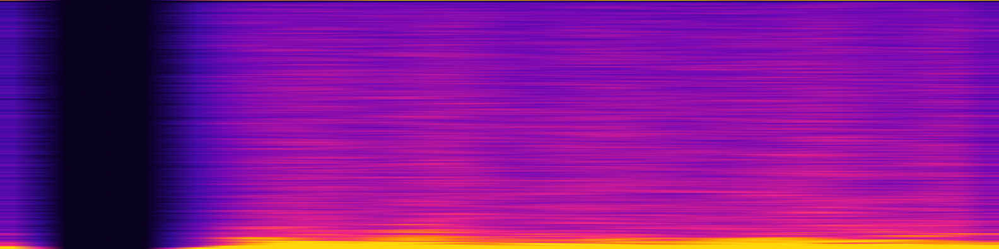

# Hidden-state divergence



The original butterfly effect. The same prompt runs through GPT-2 twice at
`temperature = 1.5` with different seeds; we take the absolute difference of the two
runs' final-layer hidden states, `|A − B|`. Because GPT-2 is causal, a token's hidden
state depends only on earlier tokens — so the shared-prompt columns are bit-for-bit
identical (delta = 0) and divergence erupts exactly at the first sampled token.

Two styles:
- `raw` — the plain delta heatmap (neurons × tokens). The dark band on the left is the
  shared prompt; the eruption is sampled-token divergence.
- `banner` — neuron rows sorted by mean divergence and blurred into flowing bands.

**What it represents:** non-determinism made visible — how far two "identical" runs
drift once sampling kicks in.

## Usage

```bash
python generate.py --style banner --size wallpaper_4k --palette turbo
python generate.py --style raw --size banner --palette magma
```

- `--style` — `raw` or `banner`. `--palette` — `magma`, `inferno`, `turbo`,
  `viridis`, `plasma`, `twilight`, `butterfly`. `--size`, `--out`.

Delta cached in `delta.npy` (recomputed from GPT-2 if missing; needs `torch`/
`transformers`). `gallery/` holds sample renders.
