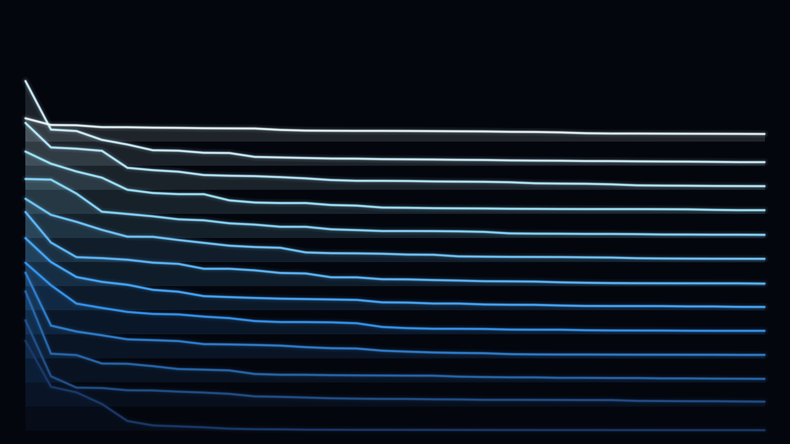

# Logit-lens aurora



How GPT-2 makes up its mind, layer by layer. The **logit lens** applies the model's
output head (final LayerNorm + unembedding) to *every* layer's hidden state — not just
the last — revealing the next-token distribution the model is "considering" at each
depth. For the final position we take that distribution's sorted top probabilities per
layer and stack them as glowing ridgelines, one per layer, from bottom (embedding) to
top (final layer).

Early layers are flat and near-uniform — the model is undecided. Deeper layers spike as
probability mass concentrates on a few tokens: the prediction sharpening into a decision
as information flows up the residual stream.

**What it represents:** computation as commitment — the moment across depth when the
model stops hedging and picks an answer.

## Usage

```bash
python generate.py --size wallpaper_4k --palette glow
python generate.py --prompt "Once upon a time" --top 40
```

- `--palette` — `glow`, `ember`, `aurora`, `violet`. `--top` — tokens per ridgeline.
  `--prompt` — recomputes from GPT-2 for a new prompt. `--size`, `--out`.

Default curves cached in `logit_lens.npy` (recomputed from GPT-2 if you change
`--prompt`/`--top`). `gallery/` holds sample renders.
