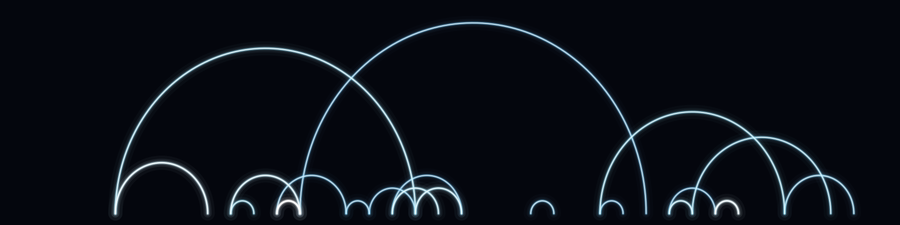

# Attention arcs



Where the two runs **attend** differently. We run the prompt through GPT-2 twice, take
`|A − B|` of a chosen layer's attention matrix (heads averaged), keep only the
strongest divergent links (top ~3%), and draw each as a thin glowing semicircular arc
connecting a query token to an earlier key token. The attention-sink at key 0 (which
every query dumps attention into) is dropped so the delicate web among later tokens
shows.

Left stays empty — the shared prompt attends identically in both runs; the arcs grow
where sampling led the two runs to look at different context.

**What it represents:** divergence in the model's routing — not *what* it computed
(concept 1) but *where it looked*.

## Usage

```bash
python generate.py --size wallpaper_4k --layer 8 --palette ice
python generate.py --size banner --layer 5 --palette gold
```

- `--layer` — transformer block `0`–`11`. Early layers = short local arcs, late
  layers = long-range spans. `--palette` — `ice`, `gold`, `violet`, `emerald`,
  `magenta`. `--size`, `--out`.

All-layer attention delta cached in `attn_all.npy` (recomputed from GPT-2 if missing;
needs eager attention). `gallery/` holds sample renders.
