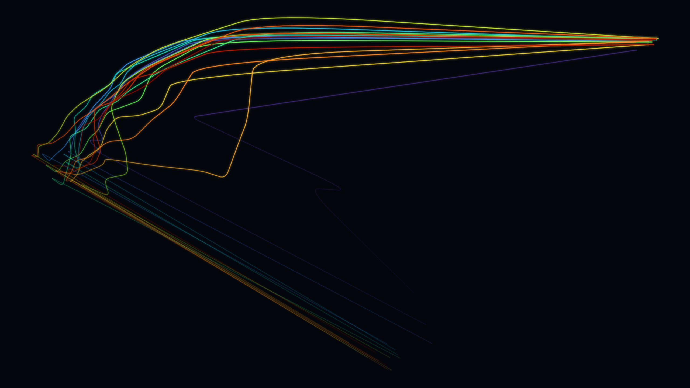

# Light-trails — *explored dead-end*



Trace each token's vector as it moves through GPT-2's 12 layers, project the whole
stack to 2D (PCA), and draw one glowing tapering ribbon per token — the model
"thinking" as silk threads.

**Why it's a dead-end:** GPT-2 has a few "massive-activation" outlier dimensions whose
magnitude explodes in later layers. They dominate the projection and collapse most
trails into a corner tangle with a single long streak. Unit-normalizing each vector
before PCA (done here) tames it somewhat, but the result never became as compelling as
concepts 7–9. Kept for completeness and because the idea is sound for models without
such outliers.

## Usage

```bash
python generate.py --size wallpaper_4k
```

Hidden states cached in `hidden_states.npy` (recomputed from GPT-2 if missing).
`gallery/` holds a sample render.
