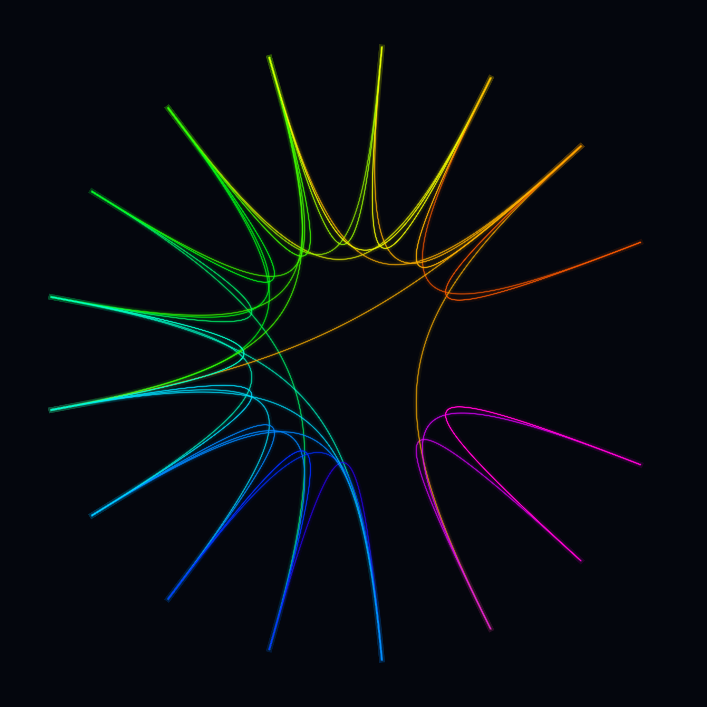

# Attention flow field — *explored dead-end*



Reimagine attention not as discrete arcs (concept 2) but as bundled currents: place
token nodes on a circle and route each strong link through the centre — edge bundling —
so many links merge into glowing rivers.

**Why it's a dead-end:** GPT-2's attention sink (every query dumps weight onto the
first token) makes nearly all links funnel into a single thin vortex, so the result is
sparse and monochrome rather than the lush hairball intended. Dropping the sink helps a
little but concept 2 (arcs) told the divergence story more clearly. Kept for
completeness.

## Usage

```bash
python generate.py --size wallpaper_4k --layer 6
```

Attention cached in `attention.npy` (recomputed from GPT-2 if missing; needs eager
attention). `gallery/` holds a sample render.
