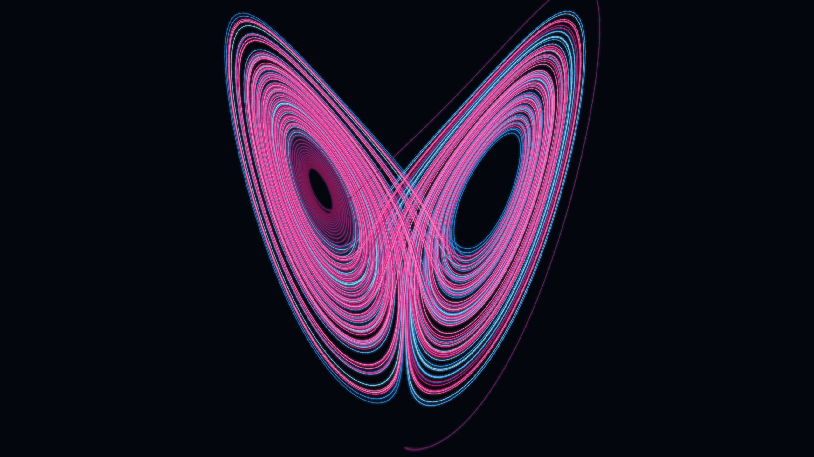

# Strange attractor



The Lorenz attractor **is** the butterfly effect. Two initial conditions differing by
`1e-3` are integrated through a chaotic ODE with RK4; they trace the same two-lobed
"wings," then diverge — sensitive dependence on initial conditions, drawn in light.
Each trajectory is a glowing ribbon (brightness ramps along time).

**What it represents:** deterministic chaos — the namesake of this whole project.
The only concept here that is purely procedural (no GPT-2), included because it is the
literal picture of the idea driving the AI pieces: tiny differences, huge divergence.

## Usage

```bash
python generate.py --size wallpaper_4k --attractor lorenz --scheme ice_fire
python generate.py --size 2048x2048 --attractor aizawa --scheme aurora
python generate.py --size banner --attractor halvorsen --scheme gold_ice
```

- `--attractor` — `lorenz` (butterfly), `aizawa`, `thomas`, `halvorsen` (each a
  different chaotic system / shape).
- `--scheme` — two-hue pairs so the diverging paths read: `ice_fire`, `aurora`,
  `gold_ice`, `ember_ice`, `pink_teal`.
- `--size` (preset or `WxH`), `--out`. The attractor is centred at its true aspect;
  dark margins fill the rest.

`gallery/` holds sample renders.
