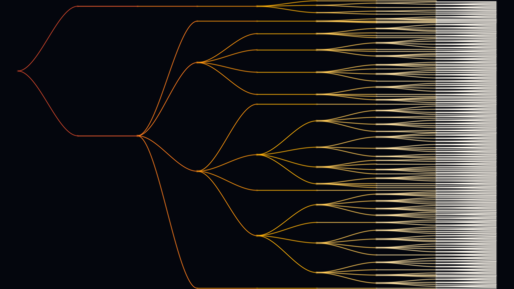

# Forking-paths tree



The butterfly effect of language. Starting from a prompt, we recursively expand the
tree of likely next-token continuations: at each node we keep every token whose
probability is within `RATIO` of the most likely one. Where the model is confident the
tree runs straight (a single trunk); where it is uncertain it forks. A single root
explodes into hundreds of possible futures — a deterministic model, diverging paths.
Colour brightens with depth, so the frontier of possibilities glows outward.

**What it represents:** non-determinism at the decoding level — every place the model
*could have* gone. Branching responds to temperature exactly as sampling does: a flatter
distribution (higher `--temp`) puts more tokens within `RATIO` of the top, so the tree
thickens.

## Usage

```bash
python generate.py --size wallpaper_4k --palette glow
python generate.py --prompt "In the beginning" --temp 2.0 --ratio 0.3 --palette ember
python generate.py --size ultrawide --palette violet --cap 800
```

Generation knobs (each recomputes the tree from GPT-2):
- `--prompt` — the seed text the futures branch from.
- `--temp` — higher = bushier (flatter distribution → more branches per node).
- `--ratio` — keep tokens with `p >= ratio * top`; lower = bushier.
- `--k` — max branches per node; `--max-depth`, `--cap` — how far the frontier expands.

Rendering knobs (never recompute): `--palette` (`glow`, `ember`, `violet`, `aurora`,
`gold`), `--size`, `--out`.

The **default** tree is cached in `tree_default.npz`, so a plain run renders offline;
changing any generation knob recomputes from GPT-2 (downloaded on demand via
`transformers`). `gallery/` holds sample renders.
