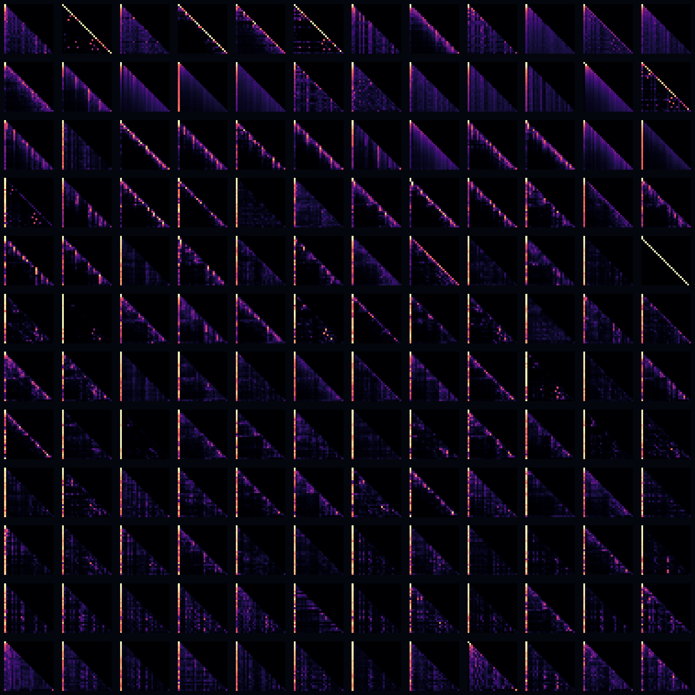

# Attention-head atlas



A map of GPT-2's whole attention apparatus. One forward pass exposes every head's
attention matrix — 12 layers × 12 heads = 144 heads — and we lay them out as a 12×12
contact sheet of small glowing glyphs (rows = layers, top-to-bottom; columns = heads).
Each glyph is a causal attention matrix: a lower triangle where brightness at (query,
key) is how much that query token attends to that earlier key.

Read the repertoire at a glance: sharp **diagonals** (previous-token heads), bright
**first columns** (attention-sink heads that dump attention on token 0), **striped**
induction-like heads, and soft **diffuse** heads that spread attention broadly.

**What it represents:** the model's internal division of labour — the many specialised
ways a transformer routes information, all in one frame.

## Usage

```bash
python generate.py --size square --palette magma
python generate.py --size 3000x3000 --palette ice --gamma 0.5
```

- `--palette` — `magma`, `inferno`, `ice`, `aurora`, `viridis`. `--gamma` — contrast
  (`<1` lifts faint attention). `--text` — recomputes from GPT-2 for a new sentence.
  `--size`, `--out`.

Default attention cached in `attn_heads.npy` (recomputed from GPT-2 if you pass a new
`--text`; needs eager attention). `gallery/` holds sample renders.
